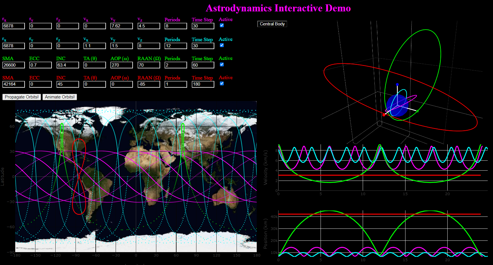

# AID - Astrodynamics Interactive Demo

`AID` is a zero dependency tool on the browser (deployed via GitHub Pages) created to easily experiment with the relationship between initial orbital conditions (by state vector or keplerian orbital elements), 3D orbits, groundtracks, and position / velocity magnitude vs. time.

[AID README and source code](https://github.com/alfonsogonzalez/AWP/tree/main/docs)
[Video explaining how to use AID](https://youtu.be/KVbjQMEvI6E)
[Full version of AID](https://alfonsogonzalez.github.io/AWP/)

